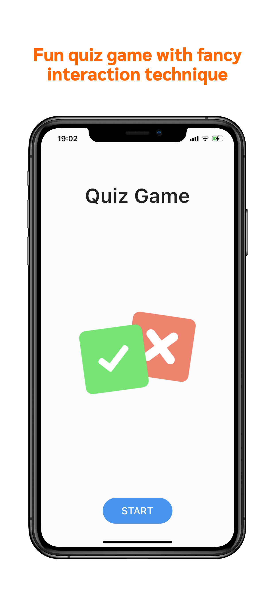
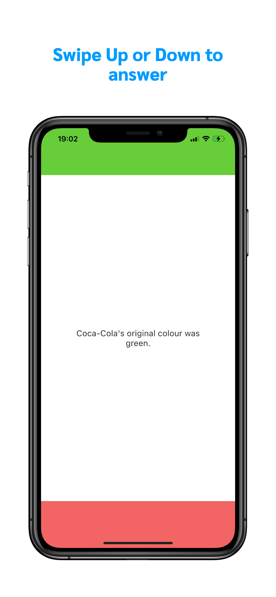
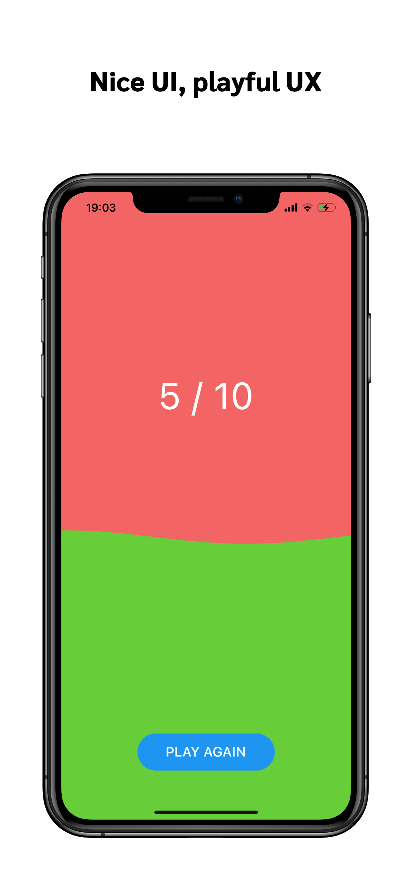
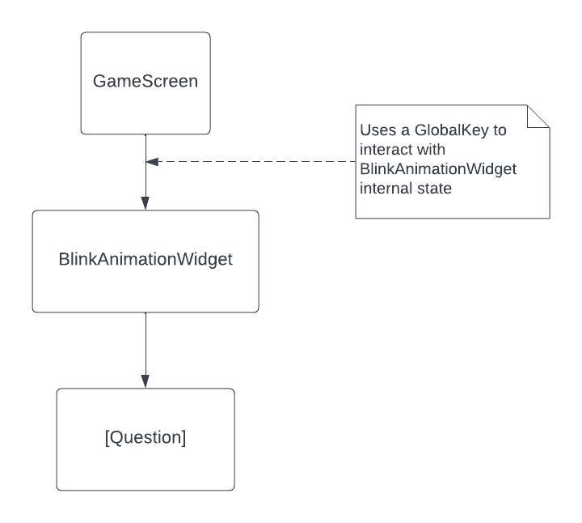
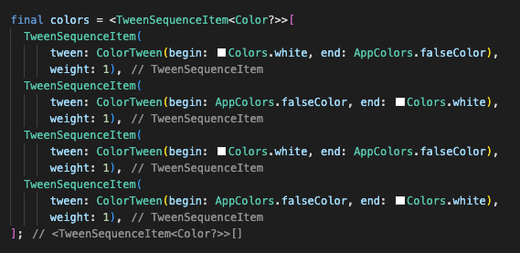
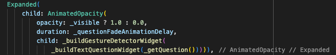
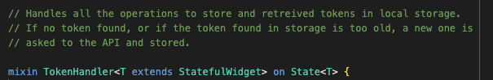
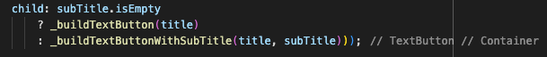
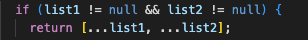
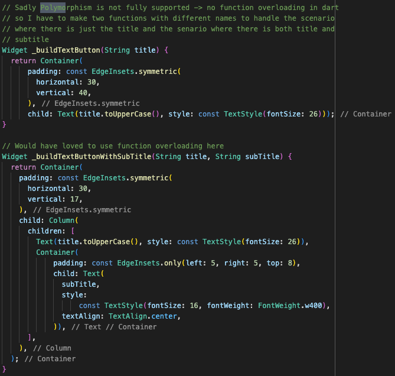

# quiz_app
 
Quiz Up is a Trivia quiz app that runs on iOS, Android and Web. 

App Store download
==================
You can download Quiz Up directly from [all stores](http://linktr.ee/quiz_up) or try it online. If you are seeing this page on a computer, use the camera in your iPhone to scan the QR code to the right.

  
  
  

---

https://user-images.githubusercontent.com/6161861/235642354-7cd07e26-a9aa-4959-820d-aeb86f499710.mp4

  
   
  

This app uses Provider as State Management, and SharedPreferences to store data.

# Features
# Tech Implementation
# Code Highlight

* * *

# Features
## Lottie animation
The app features advanced animations. For instance, the animation that shows how to use the app is made with Lottie. It displayes a finger that swipes Up then Down.

## Swipe to answer animation (blinking screen + text fade animation)
Another place where the app features advanced animations is during the game phase. When a user swipes Up or Dowwn, an animation is triggered to tell the user if his answer was wrong or right. If it's the right answer, the screen blinks once in green and if the answer is wrong the screen blinks twice in red. In the mean time the question fades out and a new one fades in.

## Score Animation
The score screen display a nice animation with a wave type animation that fills the screen based on the number of correct answers.

* * *

# Tech Implementation
## Blink Animation Widget
### Architecture
The whole blinking animation is handled in a dedicated widget. This widget accepts a widget as child. In this context the child is the question to be displayed. This allows to seperate concerns. The whole blinking logic happens whithin the widget and in the same time, the widget can display any type of questions, whether it's a text question, or a picutre, or a video.

This highlights the OPEN/CLOSED SOLID principle. In the future, if the app has to display any other type of question it can do so without changing the blink animation widget. 

A GlobalKey is used to keep track of the BlinkAnimationWidget and control its internal state to trigger the animation when needed.

### The 2 types of animations
- TweenSequenceItem for the blinking

- AnimatedOpacity for text fade between questions

## Local storage for Token (Mixin and Singleton)
The Open Trivia DB that I use to get questions exposes an API. This API provides a token to identify a session and thus prevents the same question from reoccuring. This token is valid for 6 hours. Afer that period a new one has to be asked again. 
When the app starts, it checks local storage for an existing token (with SharedPreferences). If a token is found and is less than 6 hours old then it it used otherwise a new one is asked to the API and stored.

All the functions handling the token retrieval and storage are exposed through a Mixin so that it can be used everywhere in the code base.

I use a singleton to make that token accessible throughout the entire app.

## Factory Method Design Pattern for Quiz creation
Once again, to follow the OPEN/CLOSED SOLOID principle, I use a design pattern to make sure that the app can be modular and accepts any type of quiz that can be added down the road. Currently it has simple quiz like General knowledge Quiz, History Quiz, Technology Quiz and Sport Quiz. They all have dedicated settings. For instance the General knowledge quiz is set on easy while History and Technology are set to medium difficulty and Sport has no difficulty specified because it has so little questions that i would run out of questions too quickly. Having a Factory Method to handle the creation of quiz allow me to encapsulate the logic of the creation of each quiz (like for the difficulty for example) but also brings more modularity if a new type of quiz must be added. Indeed, with such an approach, the existing code base barely need to be changed if a new quiz has to be added, you just need to add a new item and list it in the factory.

Also the Factory Method is great when we need to create more complex items like multiple quiz (called MegaMix in the App). This kind of quiz is made by merging multiple types of quizzes. For instance, the app features a General MegaMix Quiz which displays 6 easy questions and 4 hard questions. We can also think about MegaMix quizzes that would be a mix of different categories like General knowledge and Sport and Technology. Having a Factory Method makes easy to add any type of MegaMix quiz.

# Code Highlights
## Conditional rendering

## Spread operator

## No polymorphism in Dart :(
Dart doens't support function overloading which allows to have two functions with the name but different parameters. So I had to create two seperate functions instead of one.  
